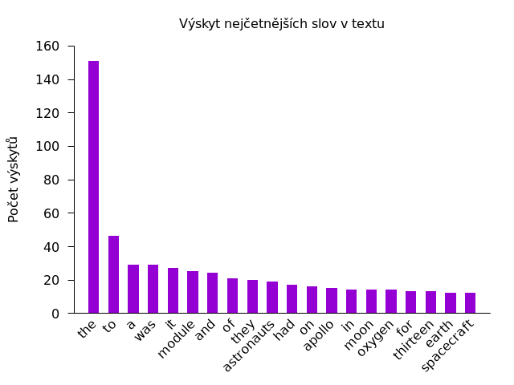

Úlohy
=====

Řešení úloh zadaných v dokumentu:
<http://monoceros.physics.muni.cz/~zbona/unix/zadani_unix.pdf>.

## A1
```
echo ~/.??*
```

## A2
S názvy souborů:
```
tail -n 1 /usr/include/*.h
```
Bez názvů souborů:
```
tail -qn 1 /usr/include/*.h
```

## A3
Triviální řešení, které vypisuje upozornění, narazí-li na adresář vyhovující
uvedenému výrazu:
```
cp /usr/include/[!0-9]*[0-9]* ~
```
Čistší řešení, které ignoruje adresáře:
```
find /usr/include -maxdepth 1 -type f -regex '[^0-9].*[0-9].*' -exec cp '{}' ~ \;
```

## A4
Následující příkaz zjistí počet zalomení řádků (tedu počet znaků `0x0a`)
v souboru `/etc/group`. Za předpokladu, že je i poslední řádek tohoto souboru
ukončen zalomením, je výsledek shodný s počtem řádků v souboru:
```
wc -l < /etc/group
```

## A5
Nastavit čas modifikace souboru `file` na 15:04 místního časového pásma
dne 11. 3. 1993:
```
touch -m --date="1993-03-11 15:04" file
```

## A6
Druhý největší ze souborů, jejichž názvy nezačínají tečkou:
```
ls -S /usr/bin | head -n2 | tail -n1
```
Je-li žádoucí zahrnout i soubory s tečkou (což se mi v adresáři `/usr/bin`
zdá zbytečné), je nutno příkaz upravit na:
```
ls -aS /usr/bin | head -n2 | tail -n1
```

## A7
```
chmod -R g+r,o-r /tmp/adresar
```
Výše uvedený příkaz provede požadované úpravy oprávnění i pro samotný adresář
`/tmp/adresar`. Je-li to nežádoucí, je nutno příkaz upravit následovně:
```
chmod -R g+r,o-r /tmp/adresar/*
```

## A8
Symbolický zápis:
```
touch file && chmod u=rwx,g=rx,o=r file
```
Oktální zápis:
```
touch file && chmod 754 file
```

## B1
Řešení je možné pomocí `cut`, `paste` a shellového skriptu, který vypíše
dostatečný počet znaků `-`, ale je nepraktické, protože by zahrnovalo
několik mezisouborů. Místo toho můžeme použít editor `sed`:
```
sed -E 's/^[^;]*;/-;/' calories.csv
```
Druhou možností je užít nástroje `awk`:
```
awk 'BEGIN {FS=";"; OFS=";"}; {$1="-"; print}' calories.csv
```
Obě tato řešení vypisují výsledek do standardního výstupu. Pro úpravu souboru
je možné výsledek přesměrovat do dočasného souboru a tím pak nahradit původní
(přesměrovávat rovnou do čteného souboru může vést k chybám); u řešení pomocí
`sed`u je druhou možností použít přepínač `-i`.

## B2
Pomocí `awk`u:
```
awk 'BEGIN {FS=":"}; {print $3 ":" $1}' /etc/passwd
```

## B3
```
tail -n+2 ip-by-country.csv | cut -d, -f6 | sort -u | wc -l
```

## B4
Viz soubor `ulohy/b4.sh`:
```
#!/bin/bash

# Select numeric code and country name from each language file,
# then merge them into one list.
tail -n+2 countrycodes_en.csv | awk 'BEGIN {FS=";"} {print $4 " " $1}' > tmp_countries
tail -n+2 kodyzemi_cz.csv | awk 'BEGIN {FS=";"} {print $1 " " $4}' >> tmp_countries

# Print the number of duplicate lines
sort tmp_countries | uniq -d | cut -d" " -f2
```

Skript je nutno spustit v adresáři obsahujícím soubory `countrycodes_en.csv`
a `kodyzemi_cz.csv`.
```
make testdir && cd test && bash ../ulohy/b4.sh
```

## B5
Počet mezer na řádku ve výstupu `ls -l` je ovlivněn použitým formátem data,
proto čas vypíšeme v předem určeném formátu (`iso`), abychom si byli jisti,
že název souboru se nachází v osmém sloupci.
```
ls -l --time-style=iso | awk '$5 == 0 {print $8}'
```

## B6
```
find /usr/include -name "std*" ! -name "*.h"
```

## B7
Opět bez tečkových souborů (`.*`), které v `/usr/bin` nepředpokládám.
```
ls /usr/bin | xargs -I% file '/usr/bin/%' | \
grep -F "POSIX shell script" | cut -d: -f1
```

## B8
Primární skupina je v `/etc/passwd` uvedena ve čtvrtém sloupci.
```
cut -d: /etc/passwd -f1,4 | grep ':200$' | cut -d: -f1
```

## C2
Sed začne první cyklus načtením prvního řádku do pracovního prostoru
(„pattern space“). Příkaz `N` načte do pracovního prostoru i další řádek,
od prvního jej oddělí odřádkováním. Odřádkovací znak (`\n`) je poté
vyměněn příkazem `s` za mezeru, čímž dojde ke spojení řádků.
Jelikož ve skriptu nenásledují další příkazy, Sed vypíše takto upravený
obsah pracovního prostoru do standardního výstupu, smaže pracovní prostor
a začíná cyklus znovu s dalším dosud nepřečteným řádkem, tedy třetím:
```
sed 'N;s/\n/ /' file.txt
```

## C6
Implementace pomocí Bashe a Awku je v souboru `ulohy/c6.sh`:
```
#!/bin/bash
input="$1"
output="${1}-list.tex"

cat <<EOF > "$output"
\documentclass{article}
\begin{document}
Abecední seznam slov použitých v souboru \texttt{apollo}:
\begin{itemize}
EOF

grep -o '[A-Za-z]*' "$input" | tr "[A-Z]" "[a-z]" | sort | uniq | \
awk '{print "\\item{" $0 "}"}
	END {print "\\end{itemize}\nPočet jedinečných slov: " NR "."}' \
>> "$output"

cat <<EOF >> "$output"
\end{document}
EOF
```
Skript je nutno spustit s názvem zpracovávaného souboru v prvním (a jediném)
parametru. Výstup je uložen do souboru `apollo-list.tex`.
```
make testdir && cd test && bash ../ulohy/c6.sh apollo
```
Počet jedinečných slov v textu je 419.

## C7
Skript `ulohy/c7.sh` vypíše do standardního výstupu nejčastější slova s jejich
četností:
```
#!/bin/bash
input="$1"

grep -o '[A-Za-z]*' "$input" | tr "[A-Z]" "[a-z]" | \
sort | uniq -c | sort -k1,1rn | head -n20 | \
awk '{print $2 " " $1}'
```
Definice grafu pro Gnuplot je v souboru `ulohy/c7.gp`:
```
set style data histograms
set style histogram gap 1
set style fill solid 2
set xtics in rotate by 45 right
set title "Výskyt nejčetnějších slov v textu"
set ylabel "Počet výskytů"
set key off

set term pngcairo

plot "/dev/stdin" u 2:xtic(1)
```
Gnuplot očekává data na standardním vstupu a obrázek v binárním formátu
vypisuje do standardního výstupu:
```
make testdir && cd test && bash ../ulohy/c7.sh apollo | \
gnuplot -pc ../ulohy/c7.gp > wordcount.png
```
Výsledný graf je zde:



## D4
Řešení je publikováno na stránce
<https://is.muni.cz/www/jan.slany/unix.html?lang=cs>.
